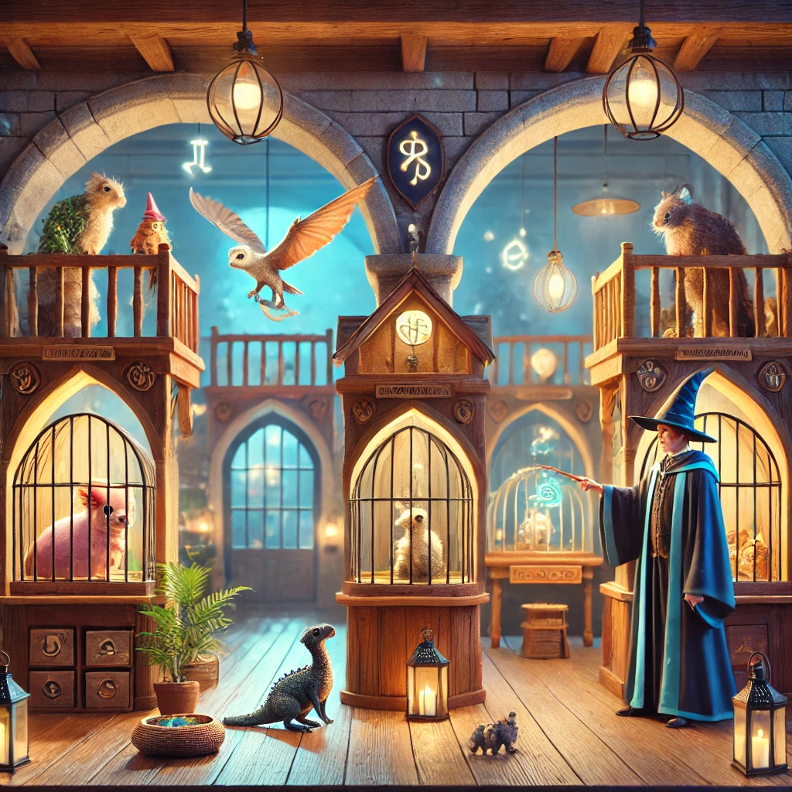

# <samp>OVERVIEW</samp>

Petwards, the shelter for fantastic beasts. Enchanted with the Spring Boot framework and a three-tier architecture, its REST API spells make shelter care effortless, summon new creatures into being, and guide adoptions with kindness. With mystical filtering woven through layers of presentation, business logic, and data access, it transforms ordinary shelter management into a sanctuary of wonder.

Group project by [clawyn](https://github.com/clawyn), [olankens](https://github.com/olankens), and [titou](https://github.com/DelaunoisThibault).

### Some Illustrations



Dylan, depicted in the image on the left, was once a mighty wizard. In an epic battle he lost his powers and his voice, though the index finger of his right hand remained enchanted. It can speak, but only to say 'Good evening' in every language.

Inspired by our beloved [dylan](https://github.com/zevraeno).

# <samp>FEATURES</samp>

- For anonymous wizards
    - List available beasts
    - Filter beasts by their capabilities
    - Register as adopter
- For adopter wizards
    - Ask for beast adoption
- For staff wizards
    - Approve or reject adoptions
    - Create beasts with capabilities
- For admin wizards
    - Create beasts with capabilities
    - Create staff wizards
    - Update shelter information

# <samp>GUIDANCE</samp>

### ER Diagram


### Clone and Debug

```shell
git clone https://github.com/olankens/petwards.git
cd petwards ; idea .
```
