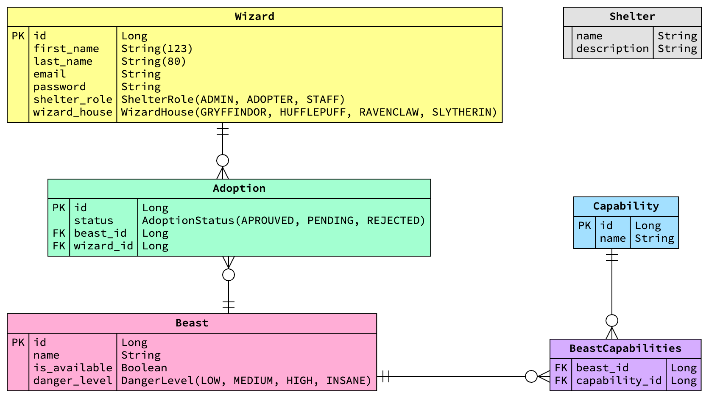
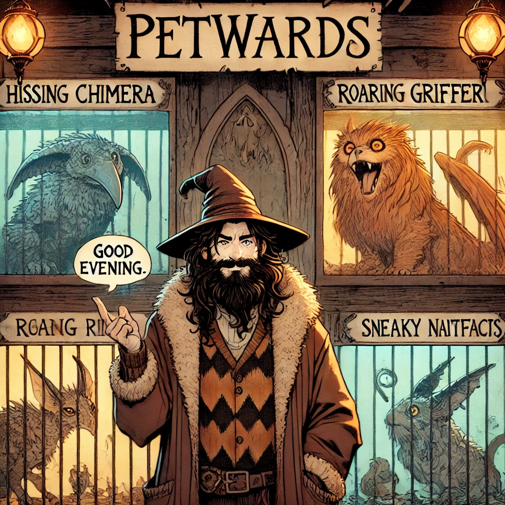
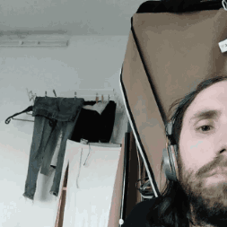
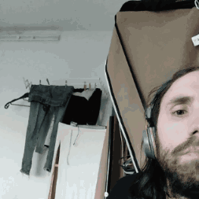
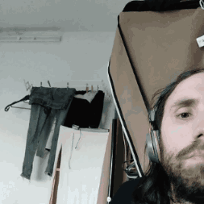

<div align="center">
    <picture>
        <source media="(prefers-color-scheme: dark)" srcset=".assets/icon-dark.svg">
        
    </picture>
    <h1><samp>PETWARDS</samp></h1>
    <p>Petwards, the shelter for fantastic beasts. Enchanted with the Spring Boot framework and a three-tier architecture, its REST API spells make shelter care effortless, summon new creatures into being, and guide adoptions with kindness. With mystical filtering woven through layers of presentation, business logic, and data access, it transforms ordinary shelter management into a sanctuary of wonder. Group project by <a href="https://github.com/clawyn">clawyn</a>, <a href="https://github.com/olankens">olankens</a>, and <a href="https://github.com/DelaunoisThibault">titou</a>.</p>
</div>

---

<h3 align="center">ER Diagram</h3>

<picture><source media="(prefers-color-scheme: dark)" srcset=".assets/erd-dark.png"></picture>

---

<h3 align="center">Majestic Dylan</h3>

<p align="center">Dylan, depicted in the image on the left, was once a mighty wizard. In an epic battle he lost his powers and his voice, though the index finger of his right hand remained enchanted. It can speak, but only to say 'Good evening' in every language.</p>



---

<h3 align="center">Debugging</h3>

```shell
git clone https://github.com/olankens/petwards.git
cd petwards ; idea .
```
