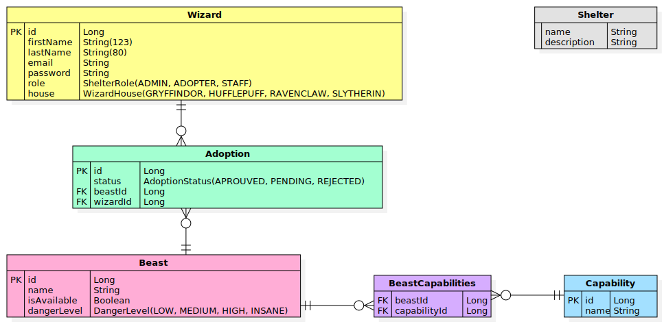

# <samp>OVERVIEW</samp>

Manage petwards, the fantastic beast shelter.


# <samp>FEEDBACK</samp>

Built with the Spring framework and a three-tier architecture, it streamlines shelter management, beast creation, and adoption, along with advanced filtering capabilities, all through distinct layers for presentation, business logic, and data access.
Developed as a group project by [clawyn](https://github.com/clawyn), [olankens](https://github.com/olankens), and [titou](https://github.com/DelaunoisThibault).

# <samp>FEATURES</samp>

- For anonymous wizards
    - List available beasts
    - Filter beasts by their capabilities
- For adopter wizards
    - Ask for beast adoption
- For staff wizards
    - Approve or reject adoptions
    - Create beasts
- For admin wizards
    - Create beasts
    - Update shelter information

# <samp>GUIDANCE</samp>

### <samp>ER DIAGRAM</samp>



### <samp>CLONE AND DEBUG PROJECT</samp>

```shell
git clone https://github.com/olankens/petwards.git
cd petwards ; idea .
```
