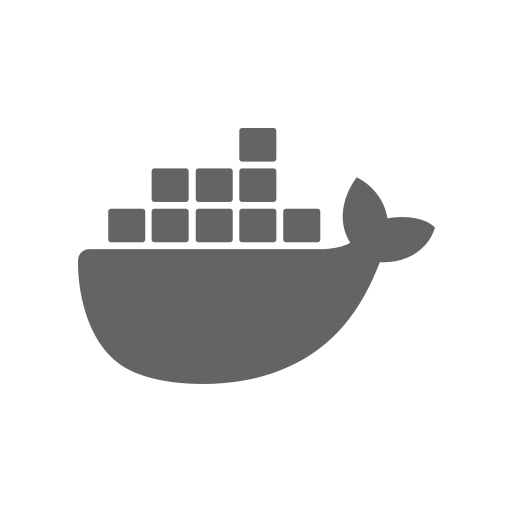

<div align="center">
  <p></p>
  <h1><code>PETWARDS</code></h1>
</div>

<table>
  <tbody><tr><td align="center" width="99999"><div>
    <a href="https://olankens.com">WEBSITE</a>
  </div></td></tr></tbody>
  <tbody><tr><td align="center" width="99999">&nbsp;<div>
    Petwards turns daily shelter care into pure magic for fantastic beasts. Its JWT-secured Spring Boot API keeps creature records, adoption flows, and smart filters nice and neat in a clean and tidy setup.
  </div>&nbsp;</td></tr></tbody>
  <tbody><tr><td align="center" width="99999">
    <a href="https://spring.io"></a>
    <picture></picture>
    <a href="https://hibernate.org"></a>
    <picture></picture>
    <a href="https://docker.com"></a>
    <picture></picture>
    <a href="https://jwt.io"></a>
    <picture></picture>
    <a href="https://postgresql.org"></a>
  </td></tr></tbody>
</table>

## PREVIEWS

<table><tbody><tr><td width="99999">
  <picture></picture>
</td></tr></tbody></table>

## FEATURES

<table>
  <tbody><tr><td width="99999"><b>Creature records</b>: Every beast is catalogued with a name, a description, an availability flag and a danger level ranging from LOW to INSANE, so staff always know what is waiting in the enclosure.</td><td>✅</td></tr></tbody>
  <tbody><tr><td><b>Adoption workflow</b>: Wizards request a beast, the adoption starts as PENDING and staff approve or reject it, with dedicated endpoints listing pending and approved adoptions at all times.</td><td>✅</td></tr></tbody>
  <tbody><tr><td><b>Advanced filtering</b>: Browse the shelter with paginated listings and narrow them down by beast name or by magical capability, so the perfect creature is never more than a query string away.</td><td>✅</td></tr></tbody>
  <tbody><tr><td><b>JWT authentication</b>: Staff and adopters register with their email and are handed signed JSON Web Tokens, while shelter roles keep ADMIN, STAFF and ADOPTER powers cleanly separated.</td><td>✅</td></tr></tbody>
  <tbody><tr><td><b>Wizard adopters</b>: Adopters are Hogwarts wizards, sorted into GRYFFINDOR, RAVENCLAW, SLYTHERIN or HUFFLEPUFF, and every adoption they make is linked back to their wizard profile.</td><td>✅</td></tr></tbody>
  <tbody><tr><td><b>Email notifications</b>: Adoption decisions are delivered straight to the wizard's inbox through Spring Mail, so nobody is left wondering whether their favorite beast came home with them.</td><td>✅</td></tr></tbody>
  <tbody><tr><td><b>Documented API</b>: Every endpoint is exposed through springdoc-openapi, so the whole shelter API can be explored and tested from a live Swagger UI without leaving the browser.</td><td>✅</td></tr></tbody>
</table>

## LEARNING

### LAUNCH WITH INTELLIJ IDEA

```shell
idea .
```

### LAUNCH WITH VSCODE

```shell
code .
```

### UPDATE MAVEN WRAPPER

```shell
address="https://maven.apache.org/download.cgi"
pattern="Apache Maven [0-9]+\.[0-9]+\.[0-9]+"
version="$(curl -s "$address" | grep -A2 'id="CurrentMaven"' | grep -oE "$pattern" | head -1 | awk '{print $3}')"
./mvnw -N wrapper:wrapper -Dmaven="$version"
```