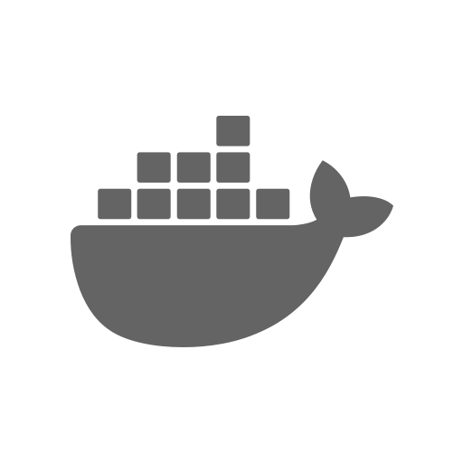

<div align="center">
  <p></p>
  <h1><code>PETWARDS</code></h1>
</div>

<table>
  <tbody><tr><td align="center" width="99999"><div>
    <a href="https://olankens.com">WEBSITE</a>
  </div></td></tr></tbody>
  <tbody><tr><td align="center" width="99999">&nbsp;<div>
    Explore magical creature adoptions through Petwards Spring Boot API secured by JWT tokens. Wizards browse beasts, submit requests, and receive email notifications while team members approve each adoption.
  </div>&nbsp;</td></tr></tbody>
  <tbody><tr><td align="center" width="99999">
    <a href="https://spring.io"></a>
    <picture></picture>
    <a href="https://hibernate.org"></a>
    <picture></picture>
    <a href="https://docker.com"></a>
    <picture></picture>
    <a href="https://jwt.io"></a>
    <picture></picture>
    <a href="https://postgresql.org"></a>
  </td></tr></tbody>
</table>

## PREVIEWS

<table><tbody><tr><td width="99999">
  <picture></picture>
</td></tr></tbody></table>

## FEATURES

<table>
  <tbody><tr><td width="99999">Catalogue magical beasts with a name, availability status, and danger level ranging from LOW to INSANE so shelter staff always know what creature waits inside each enclosure area today.</td><td>✅</td></tr></tbody>
  <tbody><tr><td>Submit adoption requests that begin as PENDING until shelter staff review and approve or reject them, with dedicated endpoints tracking every single decision stage along the entire way.</td><td>✅</td></tr></tbody>
  <tbody><tr><td>Browse paginated creature listings and narrow results by beast name or magical capability, so the perfect companion is never more than one simple query string away from immediate viewing.</td><td>✅</td></tr></tbody>
  <tbody><tr><td>Register with an email address and receive signed JSON Web Tokens, while role based access control keeps ADMIN, STAFF and ADOPTER permissions cleanly separated at all times and all places.</td><td>✅</td></tr></tbody>
  <tbody><tr><td>Sort wizard adopters into GRYFFINDOR, RAVENCLAW, SLYTHERIN or HUFFLEPUFF houses, then link every adoption record back to the owning wizard profile for easy tracking later on down the road.</td><td>✅</td></tr></tbody>
  <tbody><tr><td>Deliver adoption decisions straight to the wizard inbox through Spring Mail, ensuring nobody stays in the dark about whether their favorite beast came home safely and sound every single day.</td><td>✅</td></tr></tbody>
  <tbody><tr><td>Expose every endpoint through springdoc OpenAPI, allowing developers to explore and test the complete shelter API directly from a live Swagger UI page inside any modern web browser window.</td><td>✅</td></tr></tbody>
</table>

## LEARNING

### LAUNCH IN INTELLIJ IDEA

```shell
idea .
```

### INVOKE THE CONTAINERS

```shell
docker compose down
docker compose up
```

### PREPARE NODE TOOLING

```shell
command -v pnpm >/dev/null && pnpm install || npm install
```