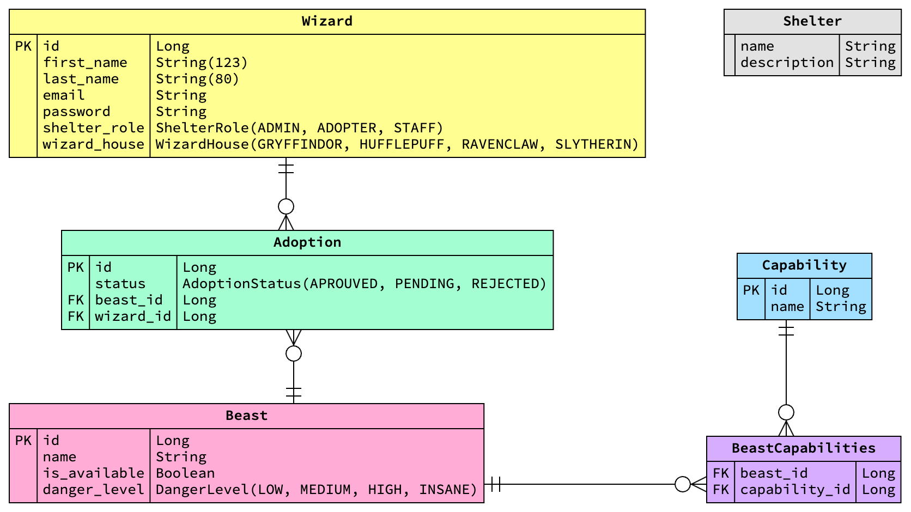

# OVERVIEW

Petwards, the shelter for fantastic beasts. Enchanted with the Spring Boot framework and a three-tier architecture, its REST API spells make shelter care effortless, summon new creatures into being, and guide adoptions with kindness. With mystical filtering woven through layers of presentation, business logic, and data access, it transforms ordinary shelter management into a sanctuary of wonder.

### Key Features

- Anonymous wizards can:
  - List available beasts
  - Filter beasts by their capabilities
  - Register as adopter
- Adopter wizards can:
  - Ask for beast adoption
- Staff wizards can:
  - Approve or reject adoptions
  - Create beasts with capabilities
- Admin wizards can:
  - Create beasts with capabilities
  - Create staff wizards
  - Update shelter information

# GUIDANCE

### ER Diagram

